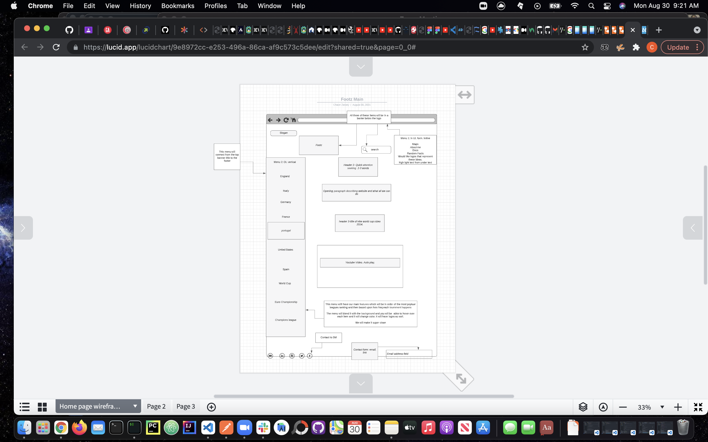

# Project Overview

Within this project you will be able to find anything related to your favorite soccer team. The project will be enable access to highlights, team scheduling, betting statistics, team sheets, random facts, coaching corner. We are a one stop shop!

## Project Name

Footz

[like to project] https://monsoudz.github.io/FootZ/

## Project Description (more detail)

Main Page- This will be the hub here we will have a discription of the site, the 2014 nike world cup commerical (for hype).

Search Bar- Be able to access any part of the site and details within it.

Map- This will be a section you can click and find different professional clubs located throughout the world.

Docs- Will be information and api used to build the app

Coaching Corner- Is a section used for coaches to connect and share ideas. Along with information provided on topics related to the game.

About Me- This will be background information of myself and why this site was built

Random Facts- It will pop up a window on whatever page you are on and give you a random fact about the game.

on the left sided menu: We have will have a home button, it will also have access to the top 5 leagues and main compeitions within the game of soccer.

footer - will have contact information and it will have social media connections

## API and Data Sample

Specify the API you are using and include a link. Show us a snippet of JSON returned by your API so we know you can access it and get the info you need

https://www.football-data.org/ Access to 12 leagues, scores, schedules and more...

switched to https://livescore-api.com/api-client/leagues/table.json?competition_id=${id}&key=7RdxOmdooHD8HFJ7&secret=vpvAC0FwBlWjniou9C2YZgmnX0vFGeNb`);

```"scorers": [
       {
           "player": {
               "id": 2076,
               "name": "Ciro Immobile",
               "firstName": "Ciro",
               "lastName": null,
               "dateOfBirth": "1990-02-20",
               "countryOfBirth": "Italy",
               "nationality": "Italy",
               "position": "Attacker",
               "shirtNumber": null,
               "lastUpdated": "2020-11-26T02:19:41Z"
           },
           "team": {
               "id": 110,
               "name": "SS Lazio"
           },
           "numberOfGoals": 4
       },
```

## Wireframes

Upload images of your wireframes to an image hosting site or add them to an assets folder in your repo and link them here with a description of each specific wireframe.

https://lucid.app/lucidchart/invitations/accept/inv_11b7a75b-24d2-4c1c-aaa2-675a53b00620?viewport_loc=-163%2C-36%2C2312%2C1070%2C0_0

https://ibb.co/RbVdmzc



The wire frame is of the home page^

### MVP/PostMVP

The functionality will then be divided into two separate lists: MPV and PostMVP. Carefully decided what is placed into your MVP as the client will expect this functionality to be implemented upon project completion.

#### MVP

_These are examples only. Replace with your own MVP features._

- Find and use one external api
- present information into a table
- Being able to access all 7 nations top league standing data

#### PostMVP

_These are examples only. Replace with your own Post-MVP features._

- Add additional apis (3-5 apis)
- Map feature allowing location of clubs on the map
- Access to all top 5 leagues pages, including teams
- Access to coaching corner
- Having a section on the home page for trending topics
- Having a comment section and fanbase team threads
- Create a favorites tap
- Create a login system to then be able to have a favorite sections
- Adding sports betting

## Project Schedule

This schedule will be used to keep track of your progress throughout the week and align with our expectations.

You are **responsible** for scheduling time with your squad to seek approval for each deliverable by the end of the corresponding day, excluding `Saturday` and `Sunday`.

| Day         | Deliverable                                                                            | Status     |
| ----------- | -------------------------------------------------------------------------------------- | ---------- |
| August 30   | Technical report due / finish build out of main page html / 90% css done for main page | Incomplete |
| August 31   | Build second page HTML and css / finish main page css                                  | Incomplete |
| September 1 | Js coding for api structure/ adding second api                                         | Incomplete |
| September 2 | Finalize code for api / final css adjustments                                          | Incomplete |
| September 3 | Presentations                                                                          | Incomplete |

## Priority Matrix

Include a full list of features that have been prioritized based on the `Time and Importance` Matrix. Link this image in a similar manner to your wireframes

https://sync.appfluence.com/native/api/v1/item/1883534807/

## Timeframes

Tell us how long you anticipate spending on each area of development. Be sure to consider how many hours a day you plan to be coding and how many days you have available until presentation day.

Time frames are also key in the development cycle. You have limited time to code all phases of the game. Your estimates can then be used to evalute game possibilities based on time needed and the actual time you have before game must be submitted. It's always best to pad the time by a few hours so that you account for the unknown so add and additional hour or two to each component to play it safe. Throughout your project, keep track of your Time Invested and Actual Time and update your README regularly.

| Component                                                            | Priority | Estimated Time | Time Invested | Actual Time |
| -------------------------------------------------------------------- | :------: | :------------: | :-----------: | :---------: |
| Build both vertical and hortizal nav bars                            |    H     |      3hrs      |               |      4      |
| Build CSS for vertical and hortizal nav bars                         |    H     |     1.5hrs     |               |      4      |
| Adding in Paragraph, headers into both bav bars                      |    H     |      2hrs      |               |      4      |
| Creating footer- connecting it to SM and making contact form         |    H     |     1.5hrs     |               |      4      |
| Connecting Api to England home page and producing wanted information |    H     |    4 hours     |               |      4      |
| Building highlights for nav bar items                                |    H     |   1.5 hours    |               |      4      |
| Building England Home Page HTML                                      |    H     |     2.5hrs     |               |      4      |
| Building England Home Page CSS                                       |    H     |     1.5hrs     |               |      4      |
| Building the table of js                                             |    H     |     1.5hrs     |               |      4      |
| Building out the information for each country                        |    H     |     1.5hrs     |               |      4      |
| Total                                                                |    H     |     48hrs      |   52 hours    |  52 hours   |

^ Not sure what all to put in the details but I would assume with 4 days of work with a min of 12 hours days and a max of 17 hours a day on the project the max time I could hit would be 48-68 hours total time.

## Code Snippet

Use this section to include a brief code snippet of functionality that you are proud of and a brief description.

.wrapper .sidebar ul li:hover a {
color: #854;
}

I'm really happy about this. I kept diving deep into css to see how powerful it was and its very powerful. Messed up my project a little i bet so its not totally clean but I really enjoy the almost blended in sidebar and the orange bronze as you glade over it.

## Change Log

Use this section to document what changes were made and the reasoning behind those changes.

I ended up taking out a couple of menu items that was making the screen too busy.

I went back and forth on how to present the information so landed on a table format.

i took off the video as well as i like the idea but the way it wasn't sitting with me right.
